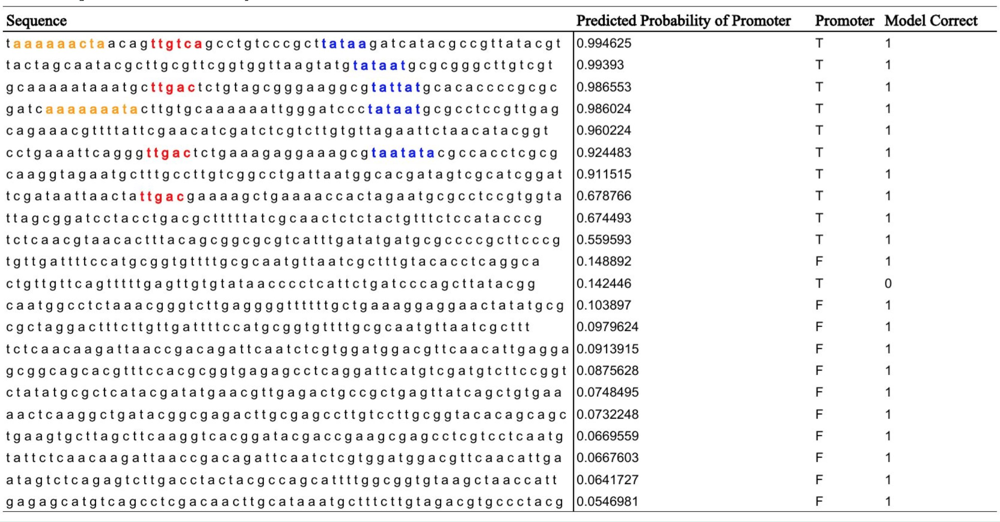

# DNA Promoter Analysis with Machine Learning

# Introduction/ Background/ Motivation

Promoters are regions in DNA sequences that are recognition sites for RNA-polymerase to start transcription. These promoter sequences are fairly conserved throughout each domain of life so they allow for gene identification even when most gene sequences are different. Gene identification is important when trying to identify DNA sequences of proteins (that perform most of the biochemical processes in the body). The goal of this project is to be able to input E. coli DNA sequences into a program and have it identify and analyze the promoter regions.

# Data

I used a dataset of 106 sequences of 58 nucleotides. Half of the sequences were E. Coli promoter gene sequences, and the other half were non-promoter gene sequences from E. Coli. The data was randomly shuffled and split into train and test sets of fractions 70% and 30%.

# Methods

Google’s TensorFlow machine learning toolkit was used to create a Long Short Term Memory Network (LSTM) in python. An LSTM is a type of neural network that is able to learn from text data. LSTMs are useful for sequences of text since they contain a running memory that can model long term dependencies and structure within long sequences. A dictionary mapping each nucleotide to a number was created, and the sequences were converted into numbers. The LSTM consists of a chain of cells. Each nucleotide in the sequence was fed into a corresponding cell, so the chain was 58 nucleotides long. Model hyper parameters were sampled randomly across 800 runs. After training on the train set, the model was tested on the test set.

# Results

The LSTM was able to predict if a sequence was a promoter with 95% accuracy on the test set.

# Analysis

Predicted promoter probability was plotted with nucleotide fractions for each sequence in the test set. No trend was observed.

Bacterial promoters have common patterns that are roughly intact in most promoter sequences. The sequence TATAAT is common at the -10 position, where 0 is the start of the gene (Harley 1987). The sequence TTGACA is common at the -35 position (Harley 1987). Additionally, the sequence AAAAAARNR is sometimes present at the -42 position and the sequence AWWWWWTTTTT is sometimes in the -52 position (Harley 1987). (W = A or T, R = A or G, N = any base.)
Sequences ranked with high probability of being promoters contained one or more of these common patterns. These patterns are highlighted in the table below. Additional trends were observed. Promoters were more likely to have three adenines or guanines in a row than non-promoters.

# Conclusion

The neural network model was able to identify characteristics of E. Coli promoter sequences and identify them with high accuracy.

# References

Harley, Calvin B., and Robert P. Reynolds. (1987) Analysis of E. coli Promoter sequences. Nucleic acids research. 15(5): 2343-2361.

[See blog post here.](http://remingm.github.io/machine/learning/tensorflow/neural/networks/bioinformatics/2016/07/13/promoter-analysis.html)

## License

Copyright 2016, Michael Remington, all rights reserved.
Licensed under the [Creative Commons Attribution NonCommercial License](https://tldrlegal.com/license/creative-commons-attribution-noncommercial-(cc-nc)).

Based on [this skflow example](https://github.com/tensorflow/skflow/blob/c780f0f669137a324657284e18d1a95e94c39f27/examples/text_classification_builtin_rnn_model.py) by the Scikit Flow authors. The original license is stated below:

> Copyright 2015-present Scikit Flow Authors. All Rights Reserved.

> Licensed under the Apache License, Version 2.0 (the "License");
> you may not use this file except in compliance with the License.
> You may obtain a copy of the License at

>  http://www.apache.org/licenses/LICENSE-2.0

> Unless required by applicable law or agreed to in writing, software
> distributed under the License is distributed on an "AS IS" BASIS,
> WITHOUT WARRANTIES OR CONDITIONS OF ANY KIND, either express or implied.
> See the License for the specific language governing permissions and
> limitations under the License.
